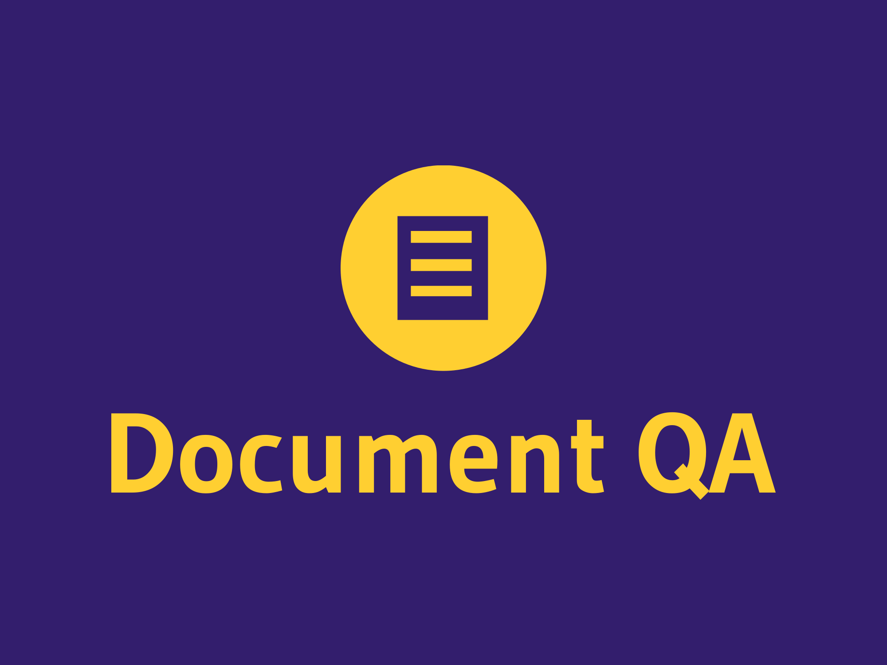

# Document Question Answering with Langchain and Llama2



This project demonstrates how to perform document question answering using the Langchain and Llama2 libraries. It allows you to extract information from PDF documents, split them into chunks, and answer questions based on the content of those documents.

## Table of Contents

- [Prerequisites](#prerequisites)
- [Installation](#installation)
- [Usage](#usage)
- [Project Structure](#project-structure)
- [Configuration](#configuration)
- [Contributing](#contributing)
- [License](#license)

## Prerequisites

Before running this project, you need to have the following prerequisites installed:

- Python 3.9 or greater
- Langchain library(langchain==0.0.300)
- Llama2 library(llama-2-13.bin)
- Other necessary dependencies (listed in requirements.txt)

You can install Langchain and Llama2 using pip:

```bash
pip install langchain llama2
